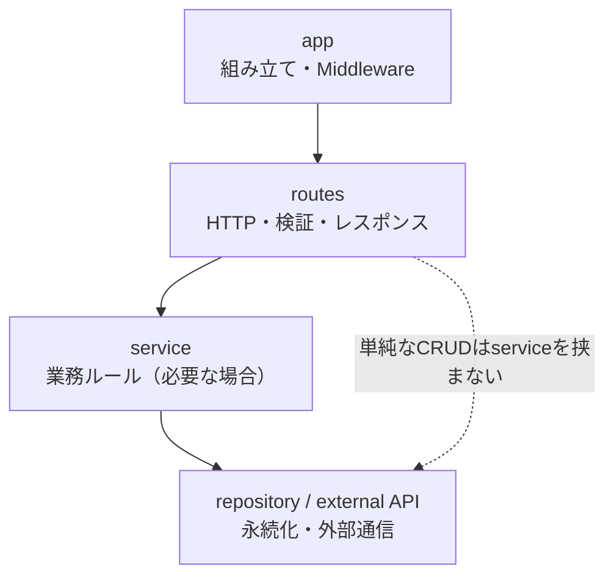
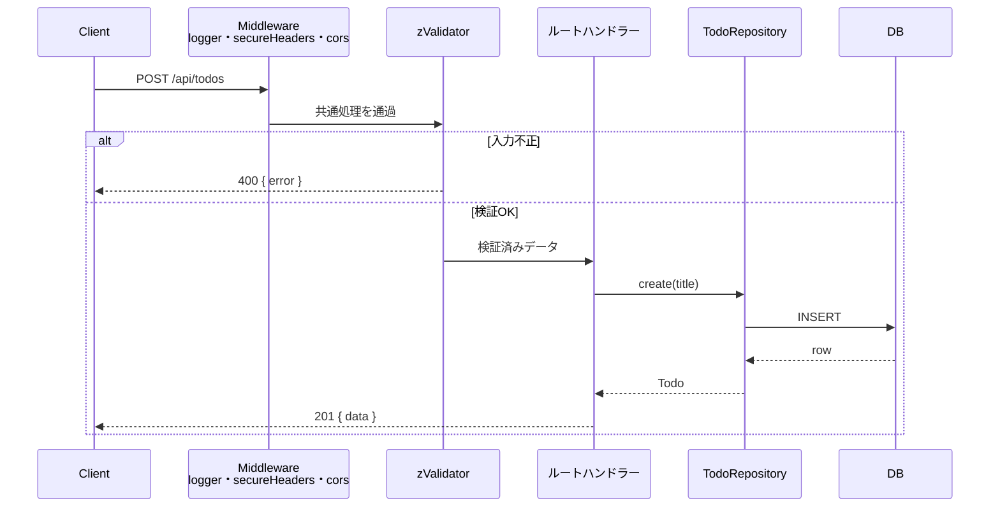

# Hono API 設計ガイド

## 目的

小〜中規模のAPIを、過剰に複雑化せず変更しやすく保つための設計方針。

このガイドでは、将来必要になるかもしれない構造を先回りして作らない。現在の変更を
安全に実装でき、次の変更時に責務を切り出せる状態を維持する。

## 基本方針

1. 機能単位でコードをまとめる
2. Honoのルート定義と型推論を活用する
3. 外部入力はルート境界で検証する
4. 複雑になった処理だけをルート外へ切り出す
5. データアクセス方法を交換できる境界を保つ
6. 公開APIの振る舞いをテストで守る

## 推奨構成

機能が少ない間は、現在のように`src/app.ts`へまとめてよい。ルート数が増えたり、
変更理由が異なるコードが混ざり始めたら、機能単位へ分割する。

```text
src/
├── app.ts
├── index.ts
├── shared/
│   ├── errors.ts
│   └── types.ts
└── features/
    └── todos/
        ├── routes.ts
        ├── schemas.ts
        ├── service.ts
        ├── repository.ts
        └── routes.test.ts
```

すべてのファイルを最初から作る必要はない。最小構成は`routes.ts`とテストのみ。

## ファイルの責務

### `app.ts`

- アプリ全体の組み立て
- 共通Middlewareの登録
- 機能ルートのマウント
- `notFound`と`onError`の設定

業務ルールやデータアクセス処理は置かない。

```ts
const app = new Hono()

app.use('*', logger())
app.route('/api/todos', todoRoutes)
```

### `features/<feature>/routes.ts`

- HTTPメソッドとパスの定義
- パス、クエリ、JSON Bodyの検証
- ServiceやRepositoryの呼び出し
- HTTPステータスとレスポンスの生成

Hono公式の推奨に合わせ、別クラスのControllerは基本的に作らない。ハンドラーは
ルート定義の近くに置き、Honoの型推論を維持する。

### `schemas.ts`

- 外部入力のZodスキーマ
- 入力から導出される型

検証ルールを複数ルートで共有する場合や、`routes.ts`が読みにくくなった場合に分離する。
DBモデルの型をそのまま入力型として使わない。

### `service.ts`

- 複数手順にまたがる処理
- 業務上の判断や制約
- トランザクション境界
- 複数Repositoryや外部APIの調整

単純なCRUDでは作らなくてよい。ルートハンドラー内の処理が長くなった場合や、同じ処理を
複数箇所から利用する場合に追加する。

### `repository.ts`

- DBや外部ストレージへのアクセス
- 永続化方式に依存する処理

メモリ配列からSQLiteやPostgreSQLへ移行する場合など、保存方法がルートやServiceへ
漏れないようにする。インターフェースは実装を交換する必要が生じた時点で追加する。

## 依存関係の向き



依存は上から下への一方向。下位層は上位層を知らない。

- RepositoryからHonoの`Context`を参照しない
- ServiceからHTTPステータスや`c.json()`を参照しない
- Hono固有の処理はルート層に留める
- 下位層から上位層をimportしない

これにより、HTTP仕様・業務処理・保存方式を個別に変更しやすくする。

## リクエスト処理の流れ

`POST /api/todos`を例にした、ミドルウェアから永続化までの流れ。



検証はルート境界（`zValidator`）で完結し、ハンドラーには検証済みデータだけが渡る。

## 分割するタイミング

次のいずれかが発生したら分割を検討する。

- 1ファイル内で異なる機能のルートを探しにくい
- ルートハンドラーが検証・業務処理・DB処理で長くなった
- 同じ処理を複数ルートから利用する
- テスト時にDBや外部APIを差し替えたい
- 変更時に無関係な箇所まで修正が必要になる

ファイル行数だけを理由に分割しない。変更理由と責務の違いを基準にする。

## API設計

### ルーティング

- リソース名は複数形: `/api/todos`
- ルートは機能単位のHonoインスタンスとして定義
- `app.route()`でメインアプリへマウント
- パスに動詞を増やさず、HTTPメソッドで操作を表現
- 特殊な操作は用途が明確なサブルートを使用

### 入力検証

- JSON Body、パスパラメーター、クエリパラメーターを外部入力として扱う
- Zodと`zValidator`でルート境界にて検証
- 検証済みデータは`c.req.valid()`から取得
- DB制約だけに入力検証を任せない

### レスポンス

- 同種のエンドポイントではレスポンス形式を統一
- 作成成功は`201`、削除成功でBodyが不要なら`204`
- 存在しないリソースは`404`
- 入力不正は`400`
- 想定外エラーは内部情報を返さず`500`

現在の基本形式:

```json
{ "data": {} }
```

```json
{ "error": "Todo not found" }
```

API規模が増え、エラーコードや詳細情報が必要になった時点で共通レスポンス型を導入する。

## エラー処理

- ルートで処理できる想定内エラーは、その場で適切なステータスへ変換
- 複数箇所で扱う業務エラーは、共通エラー型の導入を検討
- `onError`ではログを残し、利用者へ内部スタックや秘密情報を返さない
- 例外を通常の分岐処理として多用しない

## 依存性の注入

DBや外部APIを導入した場合、アプリ生成時に依存を渡せる形を優先する。

```ts
type AppDependencies = {
  todoRepository: TodoRepository
}

export const createApp = (dependencies: AppDependencies) => {
  const app = new Hono()
  app.route('/api/todos', createTodoRoutes(dependencies))
  return app
}
```

DIコンテナは導入せず、関数引数による明示的な依存注入から始める。

## テスト方針

### テストの役割

このリポジトリでは、単体テストとAPIテストを使い分ける。

| 種類 | 対象 | 主な目的 |
| --- | --- | --- |
| 単体テスト | 純粋関数、Service、業務ルール | 条件分岐や計算結果を高速に確認 |
| APIテスト | Honoアプリとルート | HTTPステータス、検証、レスポンスを確認 |
| Repositoryテスト | DBや外部ストレージとの接続 | クエリ、マッピング、制約を確認 |

すべてを単体テストにする必要はない。単純なルートはAPIテストだけで十分。条件分岐や
業務ルールをルート外へ切り出した場合に単体テストを追加する。

### 単体テストを作成するルール

- 条件分岐、計算、状態遷移など、振る舞いを持つ関数を対象にする
- Honoの`Context`、HTTP通信、DB、ファイルシステムへ依存しない状態を優先する
- 対象ファイルと同じディレクトリへ`<name>.test.ts`として配置する
- 1テストでは1つの振る舞いを確認する
- テスト名は「どの条件で、何が起きるか」が分かる名前にする（命名規約は後述）
- 正常系だけでなく、境界値、失敗条件、不具合の再現ケースを必要に応じて追加する
- 内部実装の呼び出し回数ではなく、入力に対する出力や状態変化を確認する
- 時刻、乱数、外部サービスなど不安定な依存は引数として渡せる形を優先する
- private関数を直接テストするためだけにexportしない
- カバレッジ率を上げるためだけのテストを作らない

単体テストが書きにくい場合は、対象コードがHonoのContextやデータアクセスへ強く
依存していないか確認する。ただし、テストのためだけに不要な抽象化は追加しない。

### テスト命名規約

テスト一覧を仕様書として読めるよう、次の規約で統一する。

- 一番外側の`describe`はテスト対象（関数名・API名）にする
- その内側を`describe('正常系')` / `describe('異常系')`で分類する
- `it`名は「〜こと」で終える仕様文にする（例: `作成されること`、`拒否されること`）
- 能動・受動は主語で選ぶ（操作主体なら「作成すること」、対象なら「変更されないこと」）
- カテゴリは`it`名へ前置せず、`describe`のネストで表す
- 異常系のケースが無い対象では`describe('正常系')`だけでよい

```text
Todo API
├─ 正常系
│  ├─ Todoが作成され一覧に表示されること
│  └─ 値が変わらない更新でもTodoが返ること
└─ 異常系
   ├─ 空タイトルが拒否されること
   └─ 数値でないIDが拒否されること
```

### 単体テストのサンプル

Todoの生成・更新ルールは、Honoに依存しない純粋関数として
`src/features/todos/todo.ts`へ配置する。

```ts
export const createTodo = (id: number, title: string): Todo => ({
  id,
  title,
  completed: false,
})

export const updateTodo = (todo: Todo, changes: TodoUpdate): Todo => ({
  ...todo,
  ...changes,
})
```

同じディレクトリの`todo.test.ts`で、公開される振る舞いを確認する。

```ts
describe('Todo', () => {
  describe('正常系', () => {
    it('未完了のTodoが作成されること', () => {
      const todo = createTodo(1, '単体テストを追加する')

      expect(todo.completed).toBe(false)
    })
  })
})
```

`updateTodo`は元のTodoを変更せず新しいTodoを返す。副作用を避けることで、テストと
利用側の変更を予測しやすくする。

### APIテストで優先するケース

- `app.request()`を使ったAPIの振る舞いテスト
- 正常系
- 入力不正
- 対象データが存在しない場合
- 変更した不具合の再現ケース

Honoアプリを直接テストし、通常は実際のポートを開かない。ルートで使用するServiceや
Repositoryを差し替える必要がある場合は、`createApp()`の引数から依存を渡す。

### Service・Repositoryのテスト

- 複雑な業務ルールをServiceへ切り出した場合は単体テストを追加
- Repositoryは実際のDBとの結合部分を重点的に確認
- 実装詳細ではなく、公開される振る舞いをテスト
- RepositoryをモックしたServiceテストでは、業務ルールに必要な入出力だけを差し替える
- ORMやHono自体の動作を再確認するだけのテストは作らない
- DBを使うAPI・RepositoryテストではインメモリSQLiteを使用する
- SQLiteを使うRepositoryテストは、厳密には単体テストではなく軽量な結合テストとして扱う
- MySQL固有のSQL、型、制約、マイグレーションはMySQL環境で確認する

## Middleware

- ロギング、認証、CORSなど複数ルートへ共通適用する処理に使用
- 1ルートだけで使う処理は、無理にMiddleware化しない
- Middleware内へ業務ロジックを置かない
- 適用パスを必要最小限に限定

## 避ける設計

- ルートごとにController、UseCase、Interface、Repositoryを必ず作る
- 単純なCRUDへ抽象クラスやDIコンテナを導入する
- すべてを`utils.ts`や`helpers.ts`へまとめる
- DBモデル、API入力、APIレスポンスを無条件に同一型とする
- Honoの`Context`をServiceやRepositoryまで渡す
- 将来使うかもしれない拡張ポイントを先に実装する

## 実装判断のチェックリスト

新しい機能を追加するとき:

- [ ] 既存ファイルへ追加する方が理解しやすいか
- [ ] 別機能なら`features/<feature>/routes.ts`へ分けるべきか
- [ ] 外部入力をルート境界で検証しているか
- [ ] ハンドラー内の業務処理をServiceへ切り出す必要があるか
- [ ] 保存方式の詳細がルートへ漏れていないか
- [ ] APIの振る舞いをテストで確認しているか
- [ ] 新しい抽象化が現在の複雑さを実際に減らすか

## 段階的な成長例

### 段階1: 小規模

```text
src/
├── app.ts
├── app.test.ts
└── index.ts
```

ルート、検証、単純処理を同じファイルへ配置。

### 段階2: 機能が増えた

```text
src/
├── app.ts
├── index.ts
└── features/
    ├── todos/
    │   ├── routes.ts
    │   └── routes.test.ts
    └── users/
        ├── routes.ts
        └── routes.test.ts
```

機能単位へ分割し、`app.route()`で統合。

### 段階3: DB・業務ルールが増えた

```text
features/todos/
├── routes.ts
├── schemas.ts
├── service.ts
├── repository.ts
└── routes.test.ts
```

必要になった責務だけを追加。規模ではなく、変更理由の違いを基準に分割する。

## 参考資料

- [Hono Best Practices](https://hono.dev/docs/guides/best-practices)
- [Hono Routing](https://hono.dev/docs/api/routing)
- [Hono Validation](https://hono.dev/docs/guides/validation)
- [Hono Testing](https://hono.dev/docs/guides/testing)
