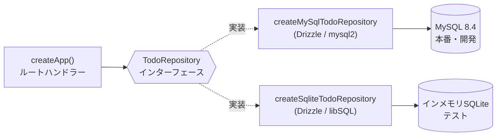

# データベース運用ガイド

## 採用構成

- ローカル開発・実行環境: MySQL 8.4
- ORM・マイグレーション: Drizzle ORM / Drizzle Kit
- テスト用DB: インメモリSQLite（libSQL）

DrizzleはSQLに近いAPIとTypeScriptの型安全性を持ち、Honoの軽量な構成を維持しやすい。
MySQL接続には公式推奨の`mysql2`ドライバーを使用する。

## ディレクトリ

```text
drizzle/                    # MySQLマイグレーション
src/db/
├── mysql/
│   ├── client.ts
│   ├── schema.ts
│   └── todo-repository.ts
└── sqlite/
    ├── schema.ts
    ├── test-database.ts
    ├── todo-repository.ts
    └── todo-repository.test.ts
```

MySQLとSQLiteではDrizzleのスキーマ定義が異なるため、DBごとにスキーマを持つ。
APIは`TodoRepository`だけに依存し、DB固有の実装へ直接依存しない。



`createApp()`へ実行時にどちらの実装を注入するかだけが変わり、ルート側のコードは
変わらない。

## ローカル開発

APIとMySQLを起動:

```sh
docker compose up --build
```

APIコンテナはMySQLの起動を待ち、`npm run db:migrate`を実行してから開発サーバーを起動する。
MySQLのデータはDocker Volumeの`mysql_data`へ保存される。

データを含めて初期化:

```sh
docker compose down -v
docker compose up --build
```

## スキーマ変更


1. `src/db/mysql/schema.ts`を変更
2. 必要に応じて`src/db/sqlite/schema.ts`とテスト用テーブル定義を変更
3. `docs/table-definitions/<テーブル物理名>.md`を作成・更新
4. MySQLマイグレーションを生成
5. 生成されたSQLを確認
6. テストとビルドを実行

```sh
docker compose run --rm api npm run db:generate
docker compose run --rm api npm run commit:check
```

生成済みマイグレーションを適用:

```sh
docker compose run --rm api npm run db:migrate
```

## シーダー

開発・動作確認用のサンプルデータは`src/db/mysql/seed.ts`で投入する。
テスト済みのRepositoryを再利用し、Drizzleを直接呼ばない。
Todoが1件でも存在する場合は何もしない（多重投入を避ける）。

```sh
docker compose run --rm api npm run db:seed
```

Makefileからは`make seed`で実行できる。本番データのシードはここに含めない。

## テスト

通常のテストではMySQLを起動せず、インメモリSQLiteを使用する。

```sh
docker compose run --rm --no-deps api npm test
```

- 純粋関数の単体テスト: DB不使用
- APIテスト: SQLite Repositoryを注入
- Repositoryテスト: SQLiteへ実際に読み書き

SQLite RepositoryテストはDBと結合するため、厳密には単体テストではなく軽量な結合テスト。
MySQL固有のSQL、型、制約、マイグレーションは、別途MySQLを使う確認で担保する。

## 実装ルール

- ルートやServiceからDrizzleを直接呼び出さない
- DB操作はRepositoryへ閉じ込める
- MySQL固有の動作へ依存する場合は、その意図を明確にする
- スキーマ変更時はマイグレーションをコミットする
- テーブル定義書は`docs/table-definitions/_template.md`に従い、1テーブル1ファイルで管理する
- MySQLスキーマを正とし、スキーマ変更時は対応するテーブル定義書を同じコミットで更新する
- 手書きSQLを追加する場合もRepository内へ配置する
- テストのためだけに本番DBの設計をSQLiteへ合わせない

## 参考資料

- [Drizzle ORM - MySQL](https://orm.drizzle.team/docs/get-started/mysql-new)
- [Drizzle ORM - SQLite](https://orm.drizzle.team/docs/get-started/sqlite-new)
- [Drizzle Kit](https://orm.drizzle.team/docs/kit-overview)
