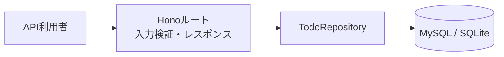

# Todo API

## 目的

利用者がTodoを作成・確認・更新・削除し、完了状態を管理できるREST APIを提供する。

## 対象範囲

### 含む

- Todoの一覧取得、作成、個別取得、更新、削除。
- タイトルと完了状態の管理。

### 含まない

- 認証・認可。
- Todoの担当者、期限、カテゴリ管理。
- ページネーション、検索、並び替え指定。

## 主な利用ケース

- 利用者がタイトルを指定してTodoを作成する。
- 利用者がTodo一覧と個別Todoを確認する。
- 利用者がタイトルまたは完了状態を更新する。
- 利用者が不要なTodoを削除する。

## 処理フロー

## API・データ変更

- API契約: [`openapi/openapi.yaml`](../../openapi/openapi.yaml)
- テーブル定義: [`docs/table-definitions/todos.md`](../table-definitions/todos.md)

## 設計判断

- 単純なCRUDのためServiceは設けず、ルートからRepositoryを利用する。
- DB実装はRepositoryで分離し、APIテストではSQLite実装を注入する。
- 関連ADR:
  - [`0001-use-hono-with-minimal-layering.md`](../decisions/0001-use-hono-with-minimal-layering.md)
  - [`0002-use-drizzle-mysql-and-sqlite-tests.md`](../decisions/0002-use-drizzle-mysql-and-sqlite-tests.md)
  - [`0003-manage-api-contract-with-openapi.md`](../decisions/0003-manage-api-contract-with-openapi.md)

## エラー・例外

- 入力不正は`400`。
- 対象Todoが存在しない場合は`404`。
- 想定外エラーは内部情報を含めず`500`。

## テスト方針

- 純粋なTodo生成・更新処理は単体テストで確認する。
- HTTPステータス、入力検証、レスポンスはAPIテストで確認する。
- SQLiteへの作成・取得・更新・削除はRepositoryテストで確認する。
